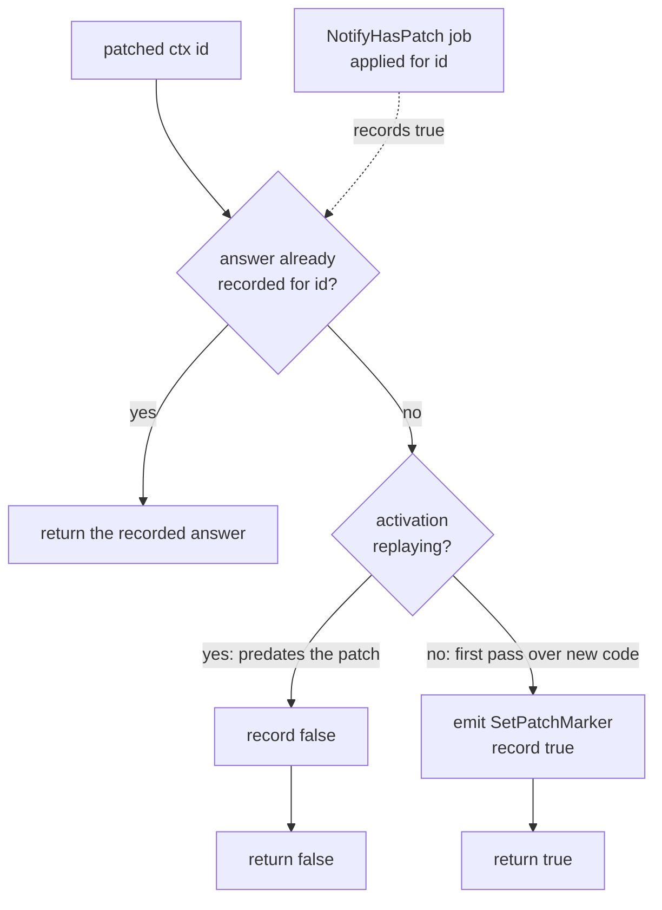

# 5. Patching

- Status: Accepted
- Date: 2026-08-04

## Context

A workflow body must replay deterministically. The runtime re-runs it from the top on
each activation and matches the commands it emits against recorded history, so editing
a workflow that has executions in flight breaks them. Swapping an activity, reordering
two calls, or adding a timer produces a command sequence that does not match what the
server recorded, and sdk-core reports nondeterminism.

That leaves an unappealing deployment story. Changing a workflow means draining every
execution that predates the change first. For a subscription renewal or an onboarding
flow that runs for months, the freeze lasts as long as the longest execution.

Patching removes the freeze. The changed region of the body goes behind a check keyed
by an identifier the developer picks. Executions that started before the change keep
taking the old branch for the rest of their lives, executions started after take the
new one, and both run under one deployed binary.

### The OTP Comparison

The shape will be familiar to anyone who has hot-upgraded an OTP release. A `gen_server`
that needs to change while its processes are live gets a `code_change(OldVsn, State,
Extra)` callback. The release handler suspends the process, calls `code_change`, and
resumes it. The BEAM holds two versions of the module at once, and a process keeps
running the old one until it makes a fully qualified call. `code:purge/1` eventually
drops the old version and kills anything still running it.

Both systems let one running deployment serve old and new behavior at the same time,
decide per instance rather than per deployment, and end with a drain-then-remove step.

The mechanisms differ in two ways that matter to this design.

- **Direction** - OTP migrates a process forward onto new code and hands it a callback
  to transform its state. Temporal pins an old execution to the old branch permanently.
  A workflow's state is derived by replaying its history rather than held in a process
  heap, so there is nothing to transform and no migration step.
- **How many versions coexist** - The BEAM holds exactly two versions of a module.
  Patch identifiers are independent of each other and accumulate, so a body can carry
  several unrelated patches at once, each answered separately.

### Prior Art in Other Language SDKs

The SDKs built on sdk-core (TypeScript, Python, .NET, Ruby) expose a boolean check and
a companion call that retires it.

- **TypeScript** - `patched(patchId)` and `deprecatePatch(patchId)`.
- **Python** - `workflow.patched(id)` and `workflow.deprecate_patch(id)`.
- **.NET** - `Workflow.Patched(id)` and `Workflow.DeprecatePatch(id)`.

Go and Java predate that API and run their own workflow engines rather than sdk-core.
Both use `GetVersion(changeId, minSupported, maxSupported)`, which returns a version
number instead of a boolean and records a differently shaped marker. This ADR follows
the sdk-core SDKs, since the SDK binds sdk-core and inherits its marker format.

The check is synchronous in every one of them. It returns a value immediately rather
than blocking the caller.

### Constraints (unchanged from ADR-0001 through ADR-0004)

1. **The re-run model** - The SDK does not persist continuations across workflow tasks.
   It re-runs the body from the top each activation and resolves operations from a
   history-ordered event log. A patch check is evaluated again on every one of those
   re-runs and must give the same answer each time.
2. **Determinism** - The answer for a given execution must be a pure function of its
   history, stable for the life of the execution.
3. **No ppx** - The API stays plain values and functions.

## Decision

Add a synchronous patch check to the workflow API, backed by the two sdk-core messages
that carry it, and answer it from state held in `replay_state`.

The API below is the proposal at the time of writing. The code in `main` is the source
of truth.

### API

```ocaml
val patched : _ ctx -> string -> bool
(** [patched ctx patch_id] reports whether this execution should take the patched
    branch. It returns immediately and never blocks. *)

val deprecate_patch : _ ctx -> string -> unit
(** [deprecate_patch ctx patch_id] records that the unpatched branch is gone and every
    future deployment carries only the patched code. *)
```

Used in a body:

```ocaml
let charge =
  if patched ctx "use-fast-charge" then execute_activity ctx charge_fast order
  else execute_activity ctx charge_legacy order
```

Both take `ctx` first, matching the rest of the `Workflow` module, and both are plain
functions rather than await points.

### How `patched` Answers

Answering and emitting are separate concerns, and only the answer has to be worked out
here. sdk-core keeps its own `encountered_patch_markers` table and drops a
`SetPatchMarker` for an identifier it has already built a command for, so the runtime
does not need an emit-once guard of its own. It also derives whether it is replaying
without being told, so the command carries no such flag. Both behaviors are in
`workflow_machines.rs` at the `WFCommandVariant::SetPatchMarker` arm.

The answer comes from two things, in order.

1. **A `NotifyHasPatch` job for this identifier arrived.** sdk-core sends this job
   before the body asks, whenever the execution's history contains the marker. Return
   `true`.
2. **No such job.** The answer comes from whether the activation is replaying. When
   replaying, the execution predates the patch, so return `false`. Otherwise this is
   the first pass over new code, so emit `SetPatchMarker` and return `true`.

Case 2 needs care in the re-run model, and it is the one behavior that does not fall
out of the existing runtime. A body re-runs from the top on every activation, including
activations that are not replaying. Consider an execution that started before the patch
existed. Its full replay carries `is_replaying = true`, so `patched` answers `false`.
The next activation delivers new work with `is_replaying = false`, the body re-runs from
the top, and case 2 would answer `true`. The execution would change branches halfway
through its life.

So the answer is decided once per run and then reused. `replay_state` gains a table
mapping patch identifier to the answer given. A `NotifyHasPatch` job writes `true` into
it when the job is applied, and the first evaluation of an identifier the job did not
cover writes whichever answer case 2 produced. A `false` answer is as sticky as a `true`
one. An eviction drops the table, and the full replay that follows re-derives it from
the same jobs in the same order.

`deprecate_patch` emits `SetPatchMarker` with `deprecated` set and returns unit. It has
no answer to memoize, since sdk-core treats the call as allowed in every history state.

The resulting decision, with the memo folded in:



Branch B is what keeps an answer stable while the body re-runs. Without it an execution
that answered `false` during its replay would answer `true` on the next activation that
carries new work.

### Wire Additions (coresdk)

Field tags pinned against the vendored protos (`coresdk.workflow_commands`,
`coresdk.workflow_activation`).

**Decode**

- `NotifyHasPatch`: `WorkflowActivationJob.notify_has_patch = 9`, field
  `patch_id = 1` (string).
- `WorkflowActivation.is_replaying = 3` (bool), currently skipped by
  `decode_wf_activation`. Threading it into the runtime is a prerequisite for case 3
  above, and it also unlocks replay-aware logging later.

**Encode**

- `SetPatchMarker`: `WorkflowCommand.set_patch_marker = 10`, fields
  `patch_id = 1` (string) and `deprecated = 2` (bool).

Nothing else is needed on the wire. sdk-core turns `SetPatchMarker` into a server-side
`RecordMarker` named `core_patch` and upserts a `TemporalChangeVersion` search attribute
so patched executions can be found by query. Both happen inside core, verified against
`patch_state_machine.rs` in the vendored source.

### Semantics

sdk-core's patch state machine documents the full behavior table. Reproduced here
because it is the contract the implementation has to satisfy.

| History has | Body has | Outcome |
| --- | --- | --- |
| not replaying | no check | not involved |
| marker | no check | nondeterminism error |
| deprecated marker | no check | marker ignored, execution continues |
| replaying, no marker | no check | not involved |
| not replaying | `patched` | marker recorded, returns `true` |
| marker | `patched` | returns `true` |
| deprecated marker | `patched` | returns `true` |
| replaying, no marker | `patched` | returns `false` |
| any | `deprecate_patch` | allowed |

Row two is the reason `deprecate_patch` exists. Once an execution's history holds a
marker, deleting the check outright breaks it, so retiring a patch takes two
deployments.

### Developer Flow

A worked example, using a trial workflow that runs for three weeks. The activities are
illustrative and are not in the e-commerce example.

**Day 0. Deploy the original.**

```ocaml
let trial_days = 21.0 *. 86400.0

let trial_workflow =
  Workflow.define ~name:"TrialWorkflow" ~input:Codec.string ~output:Codec.string
  @@ fun ctx (customer_id : string) ->
  execute_activity ctx Activities.provision_account customer_id;
  sleep ctx trial_days;
  let amount = execute_activity ctx Activities.compute_charge customer_id in
  execute_activity ctx Activities.charge_card (customer_id, amount)
```

Customers sign up over the following weeks and each one starts an execution. Every one
of them provisions an account and then parks in the timer. Their histories all record
`provision_account` at activity seq 1, a timer, and nothing after.

**Day 21. The change arrives.** A fraud check has to run before any card is charged.
Inserting the call directly breaks every execution already in flight:

```ocaml
  sleep ctx trial_days;
  execute_activity ctx Activities.fraud_check customer_id;
  let amount = execute_activity ctx Activities.compute_charge customer_id in
```

When one of those timers fires, the runtime re-runs the body from the top and matches
the commands against history. History has `compute_charge` at activity seq 2 and the
new code emits `fraud_check` there instead. sdk-core reports nondeterminism, the
workflow task fails, and it retries without ever succeeding. Rolling the worker back is
the only repair.

**Day 21. Deploy it behind a check instead.**

```ocaml
  sleep ctx trial_days;
  if patched ctx "fraud-check-before-charge" then
    execute_activity ctx Activities.fraud_check customer_id;
  let amount = execute_activity ctx Activities.compute_charge customer_id in
  execute_activity ctx Activities.charge_card (customer_id, amount)
```

Both populations now run under one binary.

- **An execution started on day 3** wakes on day 24. The body re-runs from the top and
  reaches the check while the activation is replaying, with no marker in history, so
  `patched` returns `false`. The fraud check is skipped and `compute_charge` is emitted
  at activity seq 2, matching history. Later replays answer `false` again, so the
  execution stays on the original branch for the rest of its life.
- **An execution started on day 22** reaches the check on a first pass that is not
  replaying and has no marker, so the runtime emits `SetPatchMarker` and `patched`
  returns `true`. The marker is in that execution's history from then on, and every
  replay of it answers `true`.

The identifier is what binds an execution to a branch. Neither the deploy time nor the
worker's build enters into it.

**Day 45. Retire the original branch.** First confirm that nothing predating the patch
is still running:

```
temporal workflow list --query \
  'WorkflowType="TrialWorkflow" AND ExecutionStatus="Running"'
```

The longest trial started on day 20 and closed on day 41, so every remaining execution
carries the marker. Swap the check for its retirement form and delete the dead branch:

```ocaml
  sleep ctx trial_days;
  deprecate_patch ctx "fraud-check-before-charge";
  execute_activity ctx Activities.fraud_check customer_id;
  let amount = execute_activity ctx Activities.compute_charge customer_id in
```

Skipping this deployment and going straight to the next one hits row two of the table
above. `deprecate_patch` is what keeps a marker tolerated once the body stops asking
about it.

**Day 70. Delete the call.** Once the marker-carrying executions have closed, the line
comes out and the body is ordinary code again:

```ocaml
  sleep ctx trial_days;
  execute_activity ctx Activities.fraud_check customer_id;
```

The search attribute sdk-core upserts finds the executions that still hold the marker:

```
temporal workflow list --query \
  'TemporalChangeVersion="fraud-check-before-charge" AND ExecutionStatus="Running"'
```

Introducing a change takes two deployments and removing it takes two more. The wait
between them is set by how long executions live rather than by a release schedule,
which is why a three-week trial takes roughly ten weeks to retire a patch completely.
No execution is frozen or wedged at any point in that sequence, and any of the four
deployments can happen on any day.

### Determinism

The answer is a function of history in every case. `NotifyHasPatch` arrives as an
ordinary activation job in history order, and the recorded answer makes every later
evaluation in the run agree with the first. Marker commands are emitted in fiber order
like every other command, so their position in the command sequence replays
identically.

The recorded answer governs the answer alone. The marker is emitted on every run that
takes the patched branch, since a marker in an execution's history with no matching
command from the runtime is what sdk-core reports as a workflow that does not support
this version. sdk-core drops the duplicates through its own `encountered_patch_markers`
table, so no emit-once set is needed here.

A read-only query replay suppresses the marker command through the existing
`query_mode` check in `emit`. Answering a query must not add to an execution's history.

### Interaction With Continue-As-New

Continue-as-new starts a run with empty history, so patch markers do not carry across.
A run that answered `false` before continuing answers `true` afterward, and the
execution changes branches at that boundary. This matches the other SDKs, and it is
correct for the usual case where continue-as-new marks a natural restart. A workflow
that loops through continue-as-new and needs a stable answer across runs should carry
that decision in its own input instead.

## Consequences

- **👍** Workflow code becomes deployable without draining in-flight executions, which
  is the practical blocker for changing anything the SDK runs today.
- **👍** The implementation is small next to ADR-0004. One command encoder, one job
  decoder, one activation field, and two sets in `replay_state`. `patched` never
  blocks, so the cooperative scheduler is untouched.
- **👍** Decoding `is_replaying` is useful beyond patching. Replay-aware logging needs
  the same field.
- **👎** The sticky-answer rule is a behavior with no analogue elsewhere in the runtime,
  and getting it wrong silently changes a running execution's branch rather than
  failing loudly. It needs replay tests covering the replay-then-new-work sequence and
  the eviction boundary.
- **👎** Patch checks accumulate in workflow bodies as ordinary conditionals, and
  nothing reminds a developer to finish steps 3 and 4. Bodies grow branches that outlive
  their usefulness.
- **👎** Patching covers changes to a body's control flow. It does nothing for a changed
  input or output type or a renamed workflow, which still need a new workflow type.

## Alternatives Considered

- **Worker versioning instead of patching** - Pin build identifiers to task queues and
  route old executions to workers still running old code, via
  `WorkerVersioningStrategy` in the bridge, currently set to `None`. _Rejected_ as the
  first mechanism, not on merit. It keeps bodies free of branches but requires
  operating several worker versions at once, and it needs bridge and worker
  configuration the SDK does not have yet. The two compose, and worker versioning
  deserves its own ADR.
- **`GetVersion` with version ranges, following Go and Java** - _Rejected_. sdk-core
  records the boolean marker, and matching Go's shape would mean reimplementing a
  marker format core does not produce.
- **Deriving the answer from `history_length` or a start timestamp** - _Rejected_. Any
  rule not written into the execution's own history changes meaning when the worker
  changes, which is the failure patching exists to prevent.
- **Making `patched` an await point resolved from an activation job** - _Rejected_. The
  check is synchronous in every SDK, and blocking would make an ordinary `if` in the
  body a scheduling point.

## Resolutions

The design landed across phases 0 through 4; `main` is the source of truth. Each open
question was settled as follows.

- **Post-eviction replay and `is_replaying`** - Confirmed by the phase 0 spike.
  Restarting a worker while an execution is parked, then waking it, gives one
  activation with `is_replaying = true` carrying the replayed history followed by
  activations with `is_replaying = false` carrying the new work. That is the sequence
  the recorded answer has to survive, and a from-scratch replay does not report
  `is_replaying = false` before reaching the tip. Phase 3 covers the same sequence in
  `replay_test.ml`.
- **Whether a `false` answer should still emit** - Harmless, per the phase 0 spike.
  Emitting a marker from a body replaying against a history with no marker recorded the
  marker once and the execution completed, with no workflow task failure. The spike did
  not isolate the replaying emission from the non-replaying ones that followed it in
  the same run, so it establishes that the case is not an error rather than which
  emission recorded the marker. The runtime emits only on the answer-`true` path
  regardless.
- **Emitting on every run, not only the first** - The recorded answer governs the
  answer alone. Suppressing the marker on later re-runs was written into the first
  draft of this ADR and is wrong: a marker in an execution's history with no matching
  command is what sdk-core reports as a workflow that does not support this version.
  Scenario 14 of `livetest.sh` demonstrates it directly. An execution carrying a plain
  marker, replayed against a body with the check deleted, stops making progress and the
  server records a workflow task failure. The body it is replayed against differs only
  in that the check is gone, so the missing command is the whole cause. The same
  execution replayed against a body using `deprecate_patch` completes, which is what
  makes retiring a patch a two-deployment job.
- **Where a `false` answer is memoized** - `run_state`, alongside `issued`, and
  rebuilt empty on eviction. Phase 3 covers the eviction boundary.
- **Marker position in the completion** - Markers ride in a list of their own rather
  than through the general `emit`, because a terminal command replaces the command list
  outright and would otherwise discard a marker recorded by a body that completes in the
  same activation. That also fixes their position: markers lead the completion on the
  run that records them and on every replay after it.
- **Reporting a stale patch** - Still deferred. Whether the SDK should record which
  patch identifiers a body checked, so a worker can report patches that no live
  execution needs any more, depends on the metrics work the SDK also lacks.
- **Continue-as-new** - The behavior described above is drawn from the other SDKs and
  from markers being per-run, and no test covers it. Worth one if a looping workflow
  ever depends on it.

## References

- **Concepts** - <https://docs.temporal.io/workflow-definition#workflow-versioning>,
  <https://docs.temporal.io/develop/typescript/versioning>,
  <https://docs.temporal.io/develop/python/versioning>
- **sdk-core** - `crates/sdk-core/src/worker/workflow/machines/patch_state_machine.rs`
  for the behavior table and marker handling,
  `crates/protos/protos/local/temporal/sdk/core/workflow_commands/workflow_commands.proto`
  and `.../workflow_activation/workflow_activation.proto` for the field tags
- **OTP** - `gen_server` `code_change/3` and the `sys` suspend and resume protocol,
  <https://www.erlang.org/doc/system/release_handling.html>
